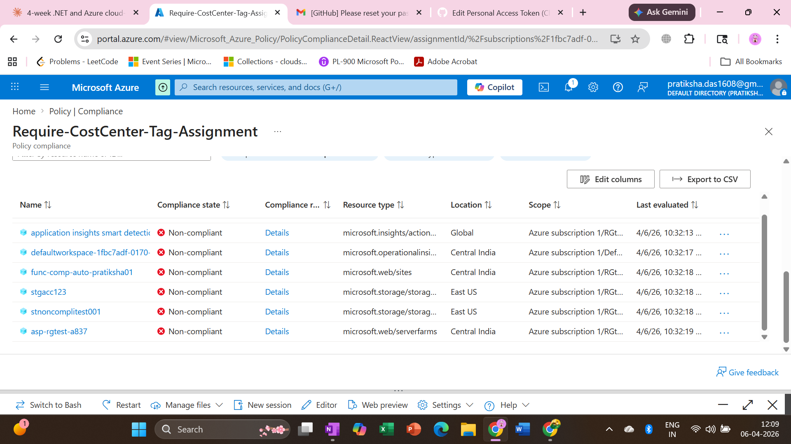
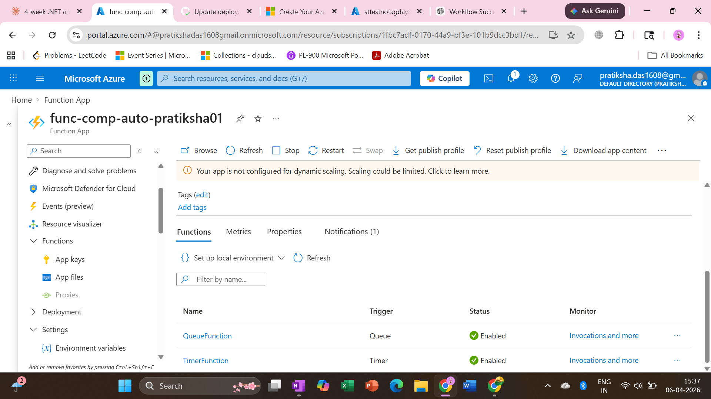
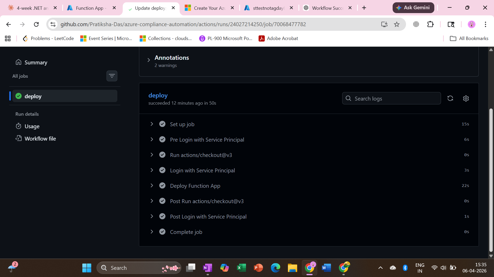
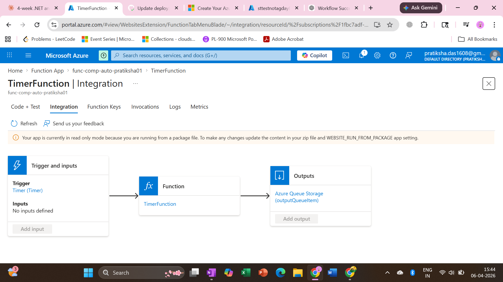
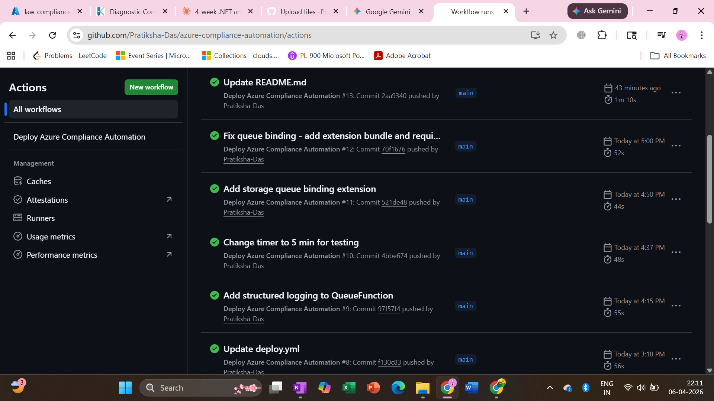
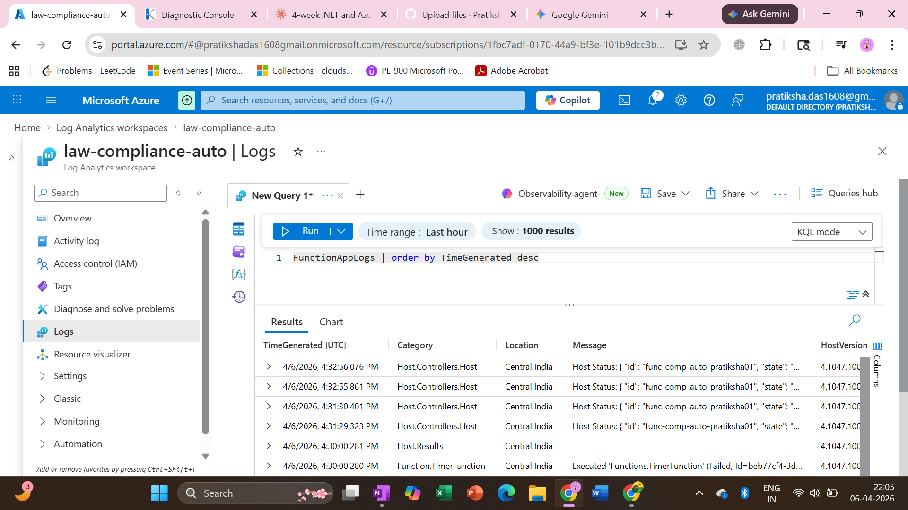

# Azure Compliance Automation Engine

Automated Azure Policy compliance detection and remediation pipeline built on Azure — zero manual intervention.

## Architecture
Azure Policy → Azure Resource Graph (KQL) → Timer Function → Queue Storage → Queue Function → PowerShell Remediation → Log Analytics

## What It Does
- Custom Azure Policy detects resources missing required tags
- Timer Function queries Azure Resource Graph every 5 mins for non-compliant resources
- Non-compliant resourceIds pushed to Azure Queue Storage
- Queue Function automatically remediates each resource by applying missing tags
- All outcomes logged to Log Analytics with KQL queryable audit trail

## Tech Stack
- PowerShell, KQL, Azure Resource Graph
- Azure Policy (custom definition), Azure Functions (Timer + Queue triggers)
- Azure Queue Storage, Log Analytics, Application Insights
- Managed Identity (zero secrets), GitHub Actions CI/CD, Service Principal

## Security Design
- No hardcoded secrets anywhere in codebase
- Managed Identity for all runtime authentication
- Service Principal scoped to Resource Group only for CI/CD
- Least privilege across all role assignments

## Screenshots
### Policy Compliance — 7 Non-Compliant Resources Detected

### Both Functions Deployed and Enabled

### CI/CD Pipeline — Green Deploy

### Timer Function Integration Diagram

### GitHub Actions Pipeline

### Log Analytics — Live Traces

## Project Status
Detection, remediation, CI/CD and observability layers complete.
Built during Azure free trial — full architecture deployed and running.

## Interview Answer
"Built an automated Azure Policy compliance remediation pipeline.
Azure Policy marks non-compliant resources. A Timer Function queries
Azure Resource Graph and pushes resourceIds to Queue Storage.
A Queue Function remediates each resource using PowerShell.
Secured with Managed Identity — zero secrets. Deployed via GitHub Actions CI/CD.
